## 1. Product Overview
Branch Admin Portal is a web-based ERP console for managing a school branch’s daily operations.
It follows the provided `stitch_super_admin_admin_pages` designs and is multi-school ready (tenant/branch-scoped data + optional branch switcher).

## 2. Core Features

### 2.1 User Roles
| Role | Registration Method | Core Permissions |
|------|---------------------|------------------|
| Branch Admin | Created by organization admin; login via email/password | Full access to assigned branch(es): manage students, staff, finance, HR, inventory, admissions, reports, settings |
| Accountant | Created by Branch Admin | Access finance pages (fees, invoices, payments, expenses, reports) within assigned branch |
| HR Manager | Created by Branch Admin | Access HR pages (employees, leaves, departments, payroll) within assigned branch |
| Inventory Manager | Created by Branch Admin | Access inventory pages (stock, purchase orders, assets) within assigned branch |
| Admission Officer | Created by Branch Admin | Access admission pages (leads, enquiries, applications) within assigned branch |
| Teacher | Created by Branch Admin/HR | Access academic pages (attendance, marks, timetable) within assigned branch |

### 2.2 Feature Module
The Branch Admin portal requirements consist of the following main pages (per Stitch designs):
1. **Login**: credentials form, remember-me, forgot password link.
2. **Forgot Password**: request OTP by email.
3. **Verify OTP & Reset Password**: OTP entry, new password form.
4. **Branch Admin Dashboard**: KPI cards, recent activity, pending approvals.
5. **Students Management**: search/filter, student list, quick actions.
6. **Add/Edit Student**: personal/academic/guardian form.
7. **Student Profile (Admin View)**: student details, performance, guardian info, action buttons.
8. **Staff Management**: search/filter, staff list with quick actions.
9. **Employee Management**: employee list + stats cards + quick actions.
10. **Add/Edit Employee**: personal + employment form with create-user option.
11. **Teacher/Employee Profile (Admin View)**: employee details, leave balance, assigned classes.
12. **Department Management**: department list CRUD.
13. **Leave Management**: request list + approve/reject + balances.
14. **Branch Settings**: settings sections and editable branch info.
15. **Attendance Management**: date/class/section selection, mark + save + export.
16. **Marks Management**: exam/class/subject selection, enter marks, publish/export.
17. **Class Management**: grades/sections overview, add class/section.
18. **Timetable Management**: timetable grid, create/edit/generate/export.
19. **Fee Management**: fee structures table, collection summary.
20. **Invoice Management**: invoice list, generate invoice.
21. **Payment Collection**: record payments, recent payments, collection totals.
22. **Expense Management**: expense list, add expense, approve pending.
23. **Payroll Management**: monthly payroll process, summary, approvals.
24. **Financial Reports**: report list + P&L example + export/email/print.
25. **Stock Management**: inventory summary, item list, stock in/out.
26. **Purchase Orders**: PO list, approvals, GRN.
27. **Asset Tracking**: asset list, depreciation report.
28. **Lead Management**: leads list, funnel metrics, convert.
29. **Enquiry Management**: enquiry log, schedule tour, convert.
30. **Admission Applications**: application list, verification, selection.
31. **Reports & Analytics Dashboard**: branch/date filtering, charts, class-wise table.
32. **Communication Center**: inbox/sent/drafts/announcements, compose.
33. **Notifications & Alerts**: categorized alerts, mark-read, settings.
34. **User Profile Settings**: basic info, password change, preferences, sessions.

### 2.3 Page Details
| Page Name | Module Name | Feature description |
|---|---|---|
| Login | Sign-in form | Authenticate with email/username + password; show validation errors; link to forgot password; remember-me. |
| Forgot Password | OTP request | Collect email; send OTP; navigate back to login. |
| Verify OTP & Reset Password | Recovery flow | Verify OTP; set new password with strength indicator; confirm password. |
| Branch Admin Dashboard | KPIs & work queue | Show KPI cards; show recent activities; show pending approvals with deep links. |
| Students Management | Student list | Search and filter (class/status); list students; provide View/Edit/Attendance/Marks actions; paginate. |
| Add/Edit Student | Student form | Capture personal, academic and guardian fields; validate required inputs; save/cancel. |
| Student Profile (Admin View) | Student overview | Display profile + academics + guardian info; offer quick actions (edit/attendance/marks/fees/print/message). |
| Staff Management | Staff list | Search/filter by role/department; list staff; actions (view/edit/delete). |
| Employee Management | Employee directory | Show employee stats; list employees; actions (view/edit/salary/leave balance). |
| Add/Edit Employee | Employee form | Capture personal + employment fields; toggle create user account/send email; save/cancel. |
| Teacher/Employee Profile | Employee overview | Display employee details, employment info, leave balances, assigned classes; provide action shortcuts. |
| Department Management | Departments | List departments; add/edit/view/delete department entries. |
| Leave Management | Leave approvals | Filter by status/employee; approve/reject/view requests; show leave balance summary; download/email summary. |
| Branch Settings | Settings hub | Navigate settings sections; edit branch info; save changes. |
| Attendance Management | Attendance | Select date/class/section; load roster; mark present/absent; save; export. |
| Marks Management | Marks entry | Select exam/class/subject; enter marks; bulk upload/export; publish results; save/clear. |
| Class Management | Classes & sections | Filter by grade; add class/section; view teacher allocation and student list shortcuts. |
| Timetable Management | Timetable grid | Select grade/section; create/edit/generate/export timetable; print/email; modify slots. |
| Fee Management | Fees | Manage fee structures (edit/delete/duplicate); show collection summary. |
| Invoice Management | Invoices | Search/filter invoices; generate invoice; view invoice details; paginate. |
| Payment Collection | Payments | Record payments; show recent payments; show daily/month totals. |
| Expense Management | Expenses | Search/filter; add expense; approve pending; show monthly totals vs budget. |
| Payroll Management | Payroll | Process payroll by month; show summary; view employee payroll rows; approve/export slips. |
| Financial Reports | Reports | Select report type; render statements; export/email/print. |
| Stock Management | Inventory | Search/filter items; add item; stock in/out; low stock alerts; export. |
| Purchase Orders | Procurement | Filter POs; create PO; approve/reject; view/GRN; paginate. |
| Asset Tracking | Assets | Search/filter assets; add/edit/maintain; depreciation report; export. |
| Lead Management | Admissions leads | Search/filter; create lead; follow-up/convert; conversion report. |
| Enquiry Management | Enquiries | Search/filter; log enquiry; schedule tour; convert to admission; callback scheduler. |
| Admission Applications | Applications | Search/filter; document verification; approve/select; send offers; generate admit artifacts. |
| Reports & Analytics Dashboard | Analytics | Filter by date range and branch; show KPI cards; charts; class-wise performance table; export/email/schedule. |
| Communication Center | Messages | Switch inbox/sent/drafts/announcements; list messages; select bulk actions; compose new message. |
| Notifications & Alerts | Alerts center | Filter by category; list alerts with deep links; mark read/clear; open notification settings. |
| User Profile Settings | Account settings | Edit basic info; change password; set notification preferences; manage active sessions. |

## 3. Core Process
1) Authentication Flow: You sign in → if password forgotten, request OTP → verify OTP → set new password → sign in.
2) Branch Context Flow (multi-school readiness): If you have multiple branch assignments, you select an active branch; all pages read/write only within that branch context.
3) Core Operations Flow: From the dashboard you navigate to Students/Staff/Finance/HR/Inventory/Admission → perform search/filter → open details/profile → add/edit records → save → return to list.

```mermaid
graph TD
  A["Login"] --> B["Branch Admin Dashboard"]
  A --> C["Forgot Password"]
  C --> D["Verify OTP & Reset Password"]
  B --> E["Students Management"]
  E --> F["Add/Edit Student"]
  E --> G["Student Profile (Admin View)"]
  B --> H["Staff Management"]
  H --> I["Employee Management"]
  I --> J["Add/Edit Employee"]
  I --> K["Teacher/Employee Profile"]
  B --> L["Attendance Management"]
  B --> M["Marks Management"]
  B --> N["Class Management"]
  N --> O["Timetable Management"]
  B --> P["Fee Management"]
  P --> Q["Invoice Management"]
  P --> R["Payment Collection"]
  P --> S["Expense Management"]
  P --> T["Payroll Management"]
  P --> U["Financial Reports"]
  B --> V["Stock Management"]
  V --> W["Purchase Orders"]
  V --> X["Asset Tracking"]
  B --> Y["Lead Management"]
  Y --> Z["Enquiry Management"]
  Y --> AA["Admission Applications"]
  B --> AB["Reports & Analytics Dashboard"]
  B --> AC["Communication Center"]
  B --> AD["Notifications & Alerts"]
  B --> AE["Branch Settings"]
  B --> AF["User Profile Settings"]
```

