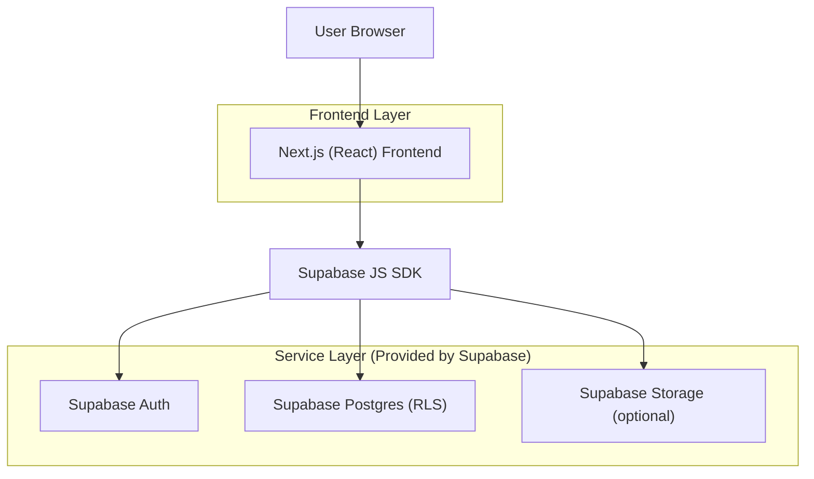
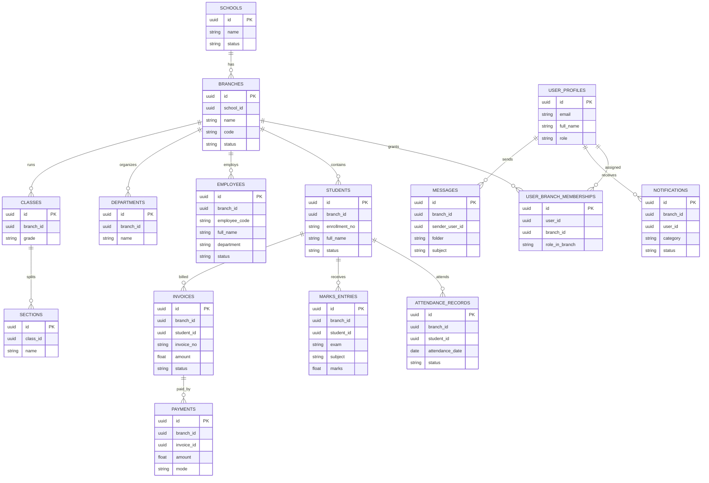

## 1.Architecture design


## 2.Technology Description
- Frontend: Next.js@16 + React@18 + TypeScript@5 + tailwindcss@3 + clsx + tailwind-merge + lucide-react
- Backend: Supabase (Auth + Postgres + Storage)

## 3.Route definitions
| Route | Purpose |
|---|---|
| /login | Login page (Stitch: login_page) |
| /forgot-password | Request OTP for password reset |
| /verify-otp | Verify OTP |
| /reset-password | Set new password |
| /dashboard | Branch Admin dashboard (branch_admin_dashboard) |
| /academic/students | Students management (students_management) |
| /academic/students/new | Add student (add_edit_student) |
| /academic/students/[id]/edit | Edit student (add_edit_student) |
| /academic/students/[id]/profile | Student profile (student_profile_admin_view) |
| /admin/staff | Staff management (staff_management) |
| /hr/employees | Employee management (employee_management) |
| /hr/employees/new | Add employee (add_edit_employee) |
| /hr/employees/[id]/edit | Edit employee (add_edit_employee) |
| /hr/employees/[id]/profile | Employee profile (teacher_profile_admin_view) |
| /hr/departments | Department management (department_management) |
| /hr/leaves | Leave management (leave_management) |
| /admin/settings | Branch settings (branch_settings) |
| /academic/attendance | Attendance (attendance_management) |
| /academic/marks | Marks (marks_management) |
| /academic/classes | Class management (class_management) |
| /academic/timetable | Timetable management (timetable_management) |
| /finance/fees | Fee management (fee_management) |
| /finance/invoices | Invoice management (invoice_management) |
| /finance/payments | Payment collection (payment_collection) |
| /finance/expenses | Expense management (expense_management) |
| /finance/payroll | Payroll management (payroll_management) |
| /finance/reports | Financial reports (financial_reports) |
| /inventory/stock | Stock management (stock_management_inventory) |
| /inventory/purchase-orders | Purchase orders (purchase_orders) |
| /inventory/assets | Asset tracking (asset_tracking) |
| /admission/leads | Lead management (lead_management) |
| /admission/enquiries | Enquiry management (enquiry_management) |
| /admission/applications | Admission applications (admission_applications) |
| /reports/analytics | Reports & analytics dashboard (reports_analytics_dashboard) |
| /communication/messages | Communication center (communication_center_1/2) |
| /notifications | Notifications & alerts (notifications_alerts) |
| /profile/settings | Profile settings (refined_user_profile_settings) |

## 6.Data model(if applicable)

### 6.1 Data model definition
Multi-school readiness is implemented via tenant scoping (`school_id`) and branch scoping (`branch_id`) on every operational table, enforced using Supabase RLS.



### 6.2 Data Definition Language
Core tenancy + membership tables (all other operational tables MUST include `school_id` or `branch_id` and follow the same RLS pattern).

```sql
-- Schools
CREATE TABLE schools (
  id UUID PRIMARY KEY DEFAULT gen_random_uuid(),
  name TEXT NOT NULL,
  status TEXT NOT NULL DEFAULT 'active',
  created_at TIMESTAMPTZ NOT NULL DEFAULT now()
);

-- Branches (logical FK to schools)
CREATE TABLE branches (
  id UUID PRIMARY KEY DEFAULT gen_random_uuid(),
  school_id UUID NOT NULL,
  name TEXT NOT NULL,
  code TEXT NOT NULL,
  status TEXT NOT NULL DEFAULT 'active',
  created_at TIMESTAMPTZ NOT NULL DEFAULT now()
);
CREATE UNIQUE INDEX branches_school_code_uq ON branches (school_id, code);

-- User profiles (logical FK to auth.users via id)
CREATE TABLE user_profiles (
  id UUID PRIMARY KEY,
  email TEXT NOT NULL,
  full_name TEXT,
  role TEXT NOT NULL,
  created_at TIMESTAMPTZ NOT NULL DEFAULT now()
);

-- Branch membership (controls multi-school readiness)
CREATE TABLE user_branch_memberships (
  id UUID PRIMARY KEY DEFAULT gen_random_uuid(),
  user_id UUID NOT NULL,
  branch_id UUID NOT NULL,
  role_in_branch TEXT NOT NULL,
  created_at TIMESTAMPTZ NOT NULL DEFAULT now()
);
CREATE UNIQUE INDEX ubm_user_branch_uq ON user_branch_memberships (user_id, branch_id);

-- Grants (typical Supabase baseline)
GRANT SELECT ON schools, branches TO anon;
GRANT ALL PRIVILEGES ON schools, branches, user_profiles, user_branch_memberships TO authenticated;
```

RLS policy intent (implemented per table):
- Allow `authenticated` users to read/write rows only when `branch_id` is in their `user_branch_memberships`.
- Branch Admin can manage all branch-scoped tables within that branch; other roles are restricted per module (finance/hr/etc.).

UI parity source of truth:
- `stitch_super_admin_admin_pages/web_app_page_designs.md`
- `stitch_super_admin_admin_pages/web_app_pages_part2.md`
- Per-page HTML + screenshots under `stitch_super_admin_admin_pages/stitch_super_admin_admin_pages/*/`